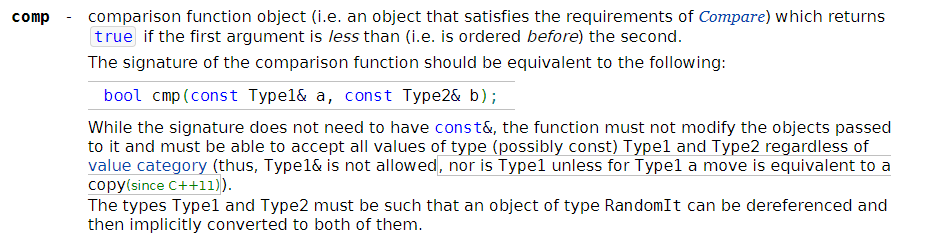

# 4/29 代码随想录Day 13 239. 滑动窗口最大值 347.前 K 个高频元素 总结栈和队列
## 239. 滑动窗口最大值- 双向队列&单调队列
[题目链接 239](https://leetcode.cn/problems/sliding-window-maximum/description/) 给你一个整数数组 nums，有一个大小为 k 的滑动窗口从数组的最左侧移动到数组的最右侧。你只可以看到在滑动窗口内的 k 个数字。滑动窗口每次只向右移动一位。

返回 滑动窗口中的最大值 。

**单调队列**
很经典的题

[随想录](https://programmercarl.com/0239.%E6%BB%91%E5%8A%A8%E7%AA%97%E5%8F%A3%E6%9C%80%E5%A4%A7%E5%80%BC.html)
[视频链接](https://www.bilibili.com/video/BV1XS4y1p7qj/)

想明白pop push getMax函数
```cpp
class Solution {
public:
    deque<int> mono;
    void push(int num) {
        while(!mono.empty() && mono.back() < num ) mono.pop_back();
        mono.push_back(num);        
    }
    void pop(int num) {
        if (num == mono.front()) mono.pop_front();
    }
    int getMax() {
        return mono.front();
    }
    vector<int> maxSlidingWindow(vector<int>& nums, int k) {
        vector<int>res;
        for (int i = 0; i < k; i++) {
            push(nums[i]);
        }
        res.push_back(getMax());
        for (int i = 0, j = k; j < nums.size(); i++, j++) {
            pop(nums[i]);
            push(nums[j]);
            res.push_back(getMax());
        }
        return res;
    }
};
```
第一遍写的代码就很工整

## 347.前 K 个高频元素- 优先队列
[题目链接](https://leetcode.cn/problems/top-k-frequent-elements/description/) 给你一个整数数组 nums 和一个整数 k ，请你返回其中出现频率前 k 高的元素。你可以按 任意顺序 返回答案。

1. 如何写cmp函数 快排&priorityQueue
2. 如何遍历哈希表 iterator
   
[随想录](https://programmercarl.com/0347.%E5%89%8DK%E4%B8%AA%E9%AB%98%E9%A2%91%E5%85%83%E7%B4%A0.html#%E7%AE%97%E6%B3%95%E5%85%AC%E5%BC%80%E8%AF%BE)

[视频链接](https://www.bilibili.com/video/BV1Xg41167Lz/)
### 自定义比较函数- Sort & PriorityQueue 
#### Sort
[Sort function DOC](https://en.cppreference.com/w/cpp/algorithm/sort)

[Youtube](https://www.youtube.com/watch?v=lz2w1t5twtU)

```cpp
struct
{
    bool operator()(int a, int b) const { return a < b; }
}
customLess;

bool less_by_second_char(const std::string &s1, const std::sztring &s2) {
    return s1.substr(1) < s2.sustr(1);
}

class str_comparator {
    public:
    str_comparator(int i = 0) : offset(i) {}
    bool operator() (const std::string &s1, const std::sztring &s2) {
        return s1.substr(offset) < s2.sustr(offset);
        }
    private:
        int offset;
    
}
```

return left>right : 大到小

#### PriorityQueue
初始化: 
```cpp
priority_queue<pair<int, int>, vector<pair<int, int>>, mycomparison> pri_que;
```

[priority queue DOC](https://en.cppreference.com/w/cpp/container/priority_queue)

[compare type DOC](https://en.cppreference.com/w/cpp/named_req/Compare)
```cpp
// Using a custom function object to compare elements.
struct
{
    bool operator()(const int l, const int r) const { return l > r; }
} customLess;
```

return left>right : 小顶堆
### 访问iterator
```cpp
 for (unordered_map<int, int>::iterator it = map.begin(); it != map.end(); it++) {
}
```

### 题目详解
#### 使用sort进行全排序
```cpp
class Solution {
public:
    class cmp {
    public:
    //cmp(){}
    bool operator() (const std::pair<int, int> &left, const std::pair<int, int> &right) {
        return left.second > right.second;
        }    
    };

    vector<int> topKFrequent(vector<int>& nums, int k) {
        vector<int> res;
        unordered_map<int, int> cnt;
        for (int i : nums) {
            if (cnt.count(i)) {
                cnt[i]++;
            } else{
                cnt[i] = 1;
            }
        }
        vector<pair<int, int>> container;
        for(unordered_map<int, int>:: iterator it = cnt.begin(); it != cnt.end(); it++) {
            container.push_back(*it);
        }
        sort(container.begin(), container.end(), cmp());
        for (int i = 0; i < k; i++) {
            res.push_back(container[i].first);
        }
        return res;
    }
};
```
注意这里类需要实例化


不用类的写法

```cpp
class Solution {
public:
    
    static bool cmp (const std::pair<int, int> &left, const std::pair<int, int> &right) {
        return left.second > right.second;
        }    
   

    vector<int> topKFrequent(vector<int>& nums, int k) {
        vector<int> res;
        unordered_map<int, int> cnt;
        for (int i : nums) {
            if (cnt.count(i)) {
                cnt[i]++;
            } else{
                cnt[i] = 1;
            }
        }
        vector<pair<int, int>> container;
        for(unordered_map<int, int>:: iterator it = cnt.begin(); it != cnt.end(); it++) {
            container.push_back(*it);
        }
        sort(container.begin(), container.end(), cmp);
        for (int i = 0; i < k; i++) {
            res.push_back(container[i].first);
        }
        return res;
    }
};
```
#### 使用 Priority Queue维护前k个

这里pq初始化的第三个输入得是类，而不是类的实例化
```cpp
class Solution {
public:
    class cmp {
    public:
    //cmp(){}
    bool operator() (const std::pair<int, int> &left, const std::pair<int, int> &right) {
        return left.second > right.second;
        }    
    };

    vector<int> topKFrequent(vector<int>& nums, int k) {
        vector<int> res(k);
        unordered_map<int, int> cnt;
        for (int i : nums) {
            if (cnt.count(i)) {
                cnt[i]++;
            } else{
                cnt[i] = 1;
            }
        }
        priority_queue <pair<int,int>, vector<pair<int, int>>, cmp> pq;
        for(unordered_map<int, int>:: iterator it = cnt.begin(); it != cnt.end(); it++) {
            pq.push(*it);//这里*it
            if (pq.size() > k) pq.pop();
        }
        for (int i = k-1; i >=0; i--) {
            res[i] = pq.top().first;
            pq.pop();
        }
        return res;
    }
};
```
#### 两个comparison总结
sort里面是一个function；

priorityqueue传入的是一个结构；

left > right 时

sort：从大到小； pq: 小顶堆； 

## 栈和队列总结
[随想录](https://programmercarl.com/%E6%A0%88%E4%B8%8E%E9%98%9F%E5%88%97%E6%80%BB%E7%BB%93.html#%E6%A0%88%E4%B8%8E%E9%98%9F%E5%88%97%E7%9A%84%E7%90%86%E8%AE%BA%E5%9F%BA%E7%A1%80)

### 栈经典问题

[括号匹配问题](https://leetcode.cn/problems/valid-parentheses/)

[字符串去重问题](https://leetcode.cn/problems/remove-all-adjacent-duplicates-in-string/description/)

[逆波兰表达式问题](https://leetcode.cn/problems/evaluate-reverse-polish-notation/)

### 队列经典问题

[滑动窗口最大值](https://leetcode.cn/problems/sliding-window-maximum/description/)
单调队列

[求前k个高频元素](https://leetcode.cn/problems/top-k-frequent-elements/description/)
优先队列