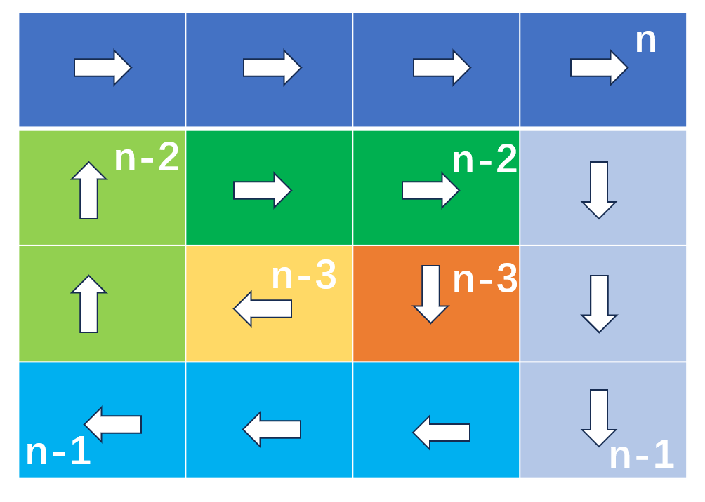

# 2024/4/18 代码随想录Day 2：977.有序数组的平方 ，209.长度最小的子数组 ，59.螺旋矩阵II 

## 977.有序数组的平方

[题目链接 977](https://programmercarl.com/%E6%95%B0%E7%BB%84%E7%90%86%E8%AE%BA%E5%9F%BA%E7%A1%80.html) 给你一个按 非递减顺序 排序的整数数组 nums，返回 每个数字的平方 组成的新数组，要求也按 非递减顺序 排序。

### 第一次提交
可以轻松简化为一个排序问题
#### C++ Version
```cpp
class Solution {
public:
    vector<int> sortedSquares(vector<int>& nums) {
        for (int i = 0; i < nums.size(); i++) {
            nums[i] = nums[i] * nums[i];
        }
        sort(nums.begin(), nums.end());
        return nums;
    }
};
```
### 复现学习优秀题解
[随想录](https://programmercarl.com/0977.%E6%9C%89%E5%BA%8F%E6%95%B0%E7%BB%84%E7%9A%84%E5%B9%B3%E6%96%B9.html)
[视频链接]( https://www.bilibili.com/video/BV1QB4y1D7ep) 双指针，空间换时间
#### C++ Version
```cpp
class Solution {
public:
    vector<int> sortedSquares(vector<int>& nums) {
        int front = 0, back = nums.size() -1;
        vector<int> res(nums.size(), 0);
        int now = nums.size() - 1;
        while (front <= back) {
            if (nums[front] * nums[front] >= nums[back] * nums[back]) {
                res[now--] = nums[front] * nums[front];
                front += 1;
            } else {
                res[now--] = nums[back] * nums[back];
                back -= 1;
            }
        }
        return res;
    }
};
```
#### Python Version
使用内置函数sorted
```python
class Solution:
    def sortedSquares(self, nums: List[int]) -> List[int]:
        return sorted(x*x for x in nums)
```
双指针
```python
class Solution:
    def sortedSquares(self, nums: List[int]) -> List[int]:
        front, back, now = 0, len(nums) - 1, len(nums) - 1
        res = [0] * len(nums)
        while front <= back:
            if nums[front] ** 2 >= nums[back] ** 2:
                res[now] = nums[front] ** 2
                front += 1
            else:
                res[now] = nums[back] ** 2
                back -= 1
            now -= 1
        return res
```
##  209.长度最小的子数组
[题目链接 209](https://leetcode.cn/problems/minimum-size-subarray-sum/description/) 给定一个含有 n 个正整数的数组和一个正整数 target 。
找出该数组中满足其总和大于等于 target 的长度最小的 连续
子数组
 [numsl, numsl+1, ..., numsr-1, numsr] ，并返回其长度。如果不存在符合条件的子数组，返回 0 。

### 第一次提交
 while循环的滑动窗口
 #### C++ Version
 ```cpp
 class Solution {
public:
    int minSubArrayLen(int target, vector<int>& nums) {
        int res = nums.size();
        int tempSum = nums[0];
        int left = 0, right = 0;
        bool active = true;
        while (active) {
            active = false;
            while (tempSum < target && right < nums.size() - 1) {
                right += 1;
                tempSum += nums[right];
                active = true;
            }
            while (tempSum >= target) {
                tempSum -= nums[left];
                left += 1;
                active = true;
            }
            res = min(res, right - left + 2);
            if (left == 0 and right == nums.size() - 1)
                res = 0;
        }
        return res;
    }
};
```
### 复现学习优秀题解
[随想录](https://programmercarl.com/0209.%E9%95%BF%E5%BA%A6%E6%9C%80%E5%B0%8F%E7%9A%84%E5%AD%90%E6%95%B0%E7%BB%84.html)
[视频链接]( https://www.bilibili.com/video/BV1tZ4y1q7XE) 思想更像是dp，找到以i为结束的最小窗口

停止条件进一步优化，一步步滑右再滑左边，更新res在循环里面简化判断条件
#### c++ Version
```cpp
class Solution {
public:
    int minSubArrayLen(int target, vector<int>& nums) {
        int res = nums.size() + 1;
        int tempSum = 0;
        int left = 0;
        for (int right = 0; right < nums.size(); right++) {
            tempSum += nums[right];
            while (tempSum >= target) {
                res = min(res, right - left + 1);
                tempSum -= nums[left++];
            }
        }
        return res == nums.size() + 1 ? 0 : res;
    }
};
```
#### Python Version
写输出的语法格式
```python
class Solution:
    def minSubArrayLen(self, target: int, nums: List[int]) -> int:
        left = 0
        length = len(nums)
        res = length + 1
        tempSum = 0
        for right in range(length):
            tempSum += nums[right]
            while tempSum >= target:
                res = min(res, right - left + 1)
                tempSum -= nums[left]
                left += 1

        return res if res != length + 1 else 0
```

##  59.螺旋矩阵II
[题目链接 59](https://leetcode.cn/problems/minimum-size-subarray-sum/description/) 给你一个正整数 n ，生成一个包含 1 到 n2 所有元素，且元素按顺时针顺序螺旋排列的 n x n 正方形矩阵 matrix 。

### 第一次提交
 n^2 = n + n-1 + n-1 + n-2 + n-2 + n-3 + n-3...，每一行填入方向不一样

前 n 个数向右，之后 n-1 个向下，n-1 个向左，以此类推。。。

方向每四次一个轮回，总共转向 2n-1 次；

每次填入 n, n-1, n-1, n-2, n-2, ..., 2, 2, 1, 1 个数。

如上图示意，每次填入的方向用箭头示意, 每次同方向填入的格子颜色相同，每次填入的个数写在了转向前格子的右上角


 ```cpp
 class Solution {
public:
    int dirs[4][2] = {{1, 0}, {0, -1}, {-1, 0}, {0, 1}};
    // down up left right

    vector<vector<int>> generateMatrix(int n) {
        vector<vector<int>> res(n, vector<int>(n, 0));
        for (int i = 0; i < n; i++)
            res[0][i] = i + 1;
        //先填入第一行
        int currentx = 0;
        int currenty = n - 1;
        int currentNum = n;
        int dirIndex = -1;// 方向指引
        // // n^2 = n + n-1 + n-1 + n-2 + n-2 + n-3 + n-3...
        for (int count = 2 * n - 2; count > 0; count--) {
            dirIndex++;
            dirIndex = dirIndex % 4;
            int len = (count + 1) / 2;
            cout << len << endl;
            for (int i = 0; i < len; i++) {
                currentNum++;
                currentx = currentx + dirs[dirIndex][0];
                currenty = currenty + dirs[dirIndex][1];
                res[currentx][currenty] = currentNum;
            }
        }
        return res;
    }
};
```
### 复现学习优秀题解
[随想录](https://programmercarl.com/0059.%E8%9E%BA%E6%97%8B%E7%9F%A9%E9%98%B5II.html)
[视频链接](https://www.bilibili.com/video/BV1SL4y1N7mV/)

这里对我第一次提交的算法进行一些优化
```cpp
class Solution {
public:
    int dirs[4][2] = {{1, 0}, {0, -1}, {-1, 0}, {0, 1}};
    // down up left right
    // 0, 1, 2, 3

    vector<vector<int>> generateMatrix(int n) {
        vector<vector<int>> res(n, vector<int>(n, 0));
        int currentx = 0;
        int currenty = -1;
        int currentNum = 1;
        int dirIndex = 3; // 方向指引向右
        // // n^2 = n + n-1 + n-1 + n-2 + n-2 + n-3 + n-3...
        for (int count = 2 * n - 1; count > 0; count--) {
            dirIndex = dirIndex % 4;
            int len = (count + 1) / 2;
            cout << len << endl;
            for (int i = 0; i < len; i++) {
                currentx = currentx + dirs[dirIndex][0];
                currenty = currenty + dirs[dirIndex][1];
                // cout<< currentx << " "<<currenty << " "<<currentNum<<endl;
                res[currentx][currenty] = currentNum;
                currentNum++;
            }
            dirIndex++;
        }
        return res;
    }
};
```