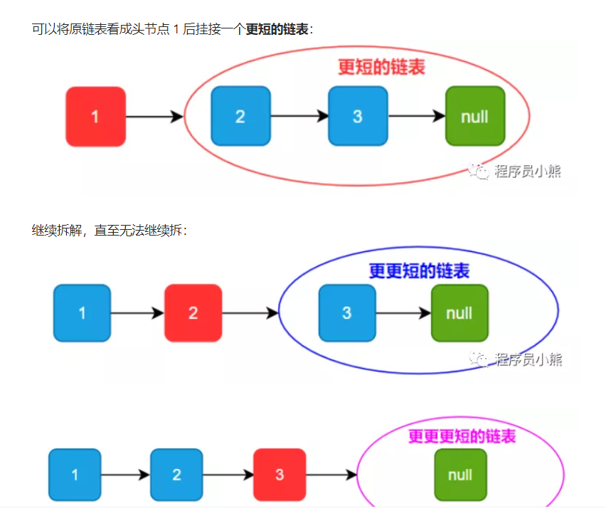

# 2024/4/19 代码随想录Day 3：链表 203.移除链表元素，707.设计链表，206.反转链表 

数组理论基础，704. 二分查找，27. 移除元素  
## 链表理论基础

[随想录文章链接](https://programmercarl.com/%E9%93%BE%E8%A1%A8%E7%90%86%E8%AE%BA%E5%9F%BA%E7%A1%80.html) 

## 203.移除链表元素
建议： 本题最关键是要理解 虚拟头结点的使用技巧，这个对链表题目很重要。

[题目链接 203](https://leetcode.cn/problems/remove-linked-list-elements/description/) 给你一个链表的头节点 head 和一个整数 val ，请你删除链表中所有满足 Node.val == val 的节点，并返回 新的头节点 。
### 第一次提交
```cpp
class Solution {
public:
    ListNode* removeElements(ListNode* head, int val) {
        while (head != nullptr && head->val == val) {
            head = head->next;
        }
        ListNode* cur = head;
        while (cur != nullptr and cur->next != nullptr) {
            if (cur->next->val == val) {
                cur->next = cur->next->next;
            } else {
                cur = cur->next;
            }
        }
        return head;
    }
};
```
### 复现学习优秀题解
[随想录](https://programmercarl.com/0203.%E7%A7%BB%E9%99%A4%E9%93%BE%E8%A1%A8%E5%85%83%E7%B4%A0.html)
[视频链接](https://www.bilibili.com/video/BV18B4y1s7R9/?vd_source=4cca6f0dd2495280b5f065c0e86f221c) 删除节点释放空间 + dummyHead

[递归方法](https://leetcode.cn/problems/remove-linked-list-elements/solutions/813358/yi-chu-lian-biao-yuan-su-by-leetcode-sol-654m/)

#### c++ Version
##### 删除节点释放空间
删除后运行速度和内存分布均有提高
```cpp
class Solution {
public:
    ListNode* removeElements(ListNode* head, int val) {
        while (head != nullptr && head->val == val) {
            ListNode* temp = head;
            head = head->next;
            delete temp;
        }
        ListNode* cur = head;
        while (cur != nullptr and cur->next != nullptr) {
            if (cur->next->val == val) {
                ListNode* temp = cur->next;
                cur->next = cur->next->next;
                delete temp;
            } else {
                cur = cur->next;
            }
        }
        return head;
    }
};
```
##### dummyHead
添加一个虚拟头节点使得所有删除节点的结构一致
```cpp
class Solution {
public:
    ListNode* removeElements(ListNode* head, int val) {
        ListNode* dummyHead = new ListNode(0, head);
        ListNode* cur = dummyHead;
        while (cur != nullptr && cur->next != nullptr) {
            ListNode* temp = cur->next;
            if (temp->val == val) {
                cur->next = temp->next;
                delete temp;
            } else {
                cur = temp;                
            }
        }
        return dummyHead->next;
    }
};
```
##### 递归
[递归写法](https://leetcode.cn/problems/remove-linked-list-elements/solutions/341875/203-yi-chu-lian-biao-yuan-su-you-ya-di-gui-c-yu-ya/)

```cpp
/**
 * Definition for singly-linked list.
 * struct ListNode {
 *     int val;
 *     ListNode *next;
 *     ListNode() : val(0), next(nullptr) {}
 *     ListNode(int x) : val(x), next(nullptr) {}
 *     ListNode(int x, ListNode *next) : val(x), next(next) {}
 * };
 */
class Solution {
public:
    ListNode* removeElements(ListNode* head, int val) {
        if (head == nullptr) return head;
        head->next = removeElements(head->next, val);
        return head->val == val? head->next : head;
    }
};
```

#### Python Version
dummyHead:
```python
class Solution:
    def removeElements(self, head: Optional[ListNode], val: int) -> Optional[ListNode]:
        dummyHead = ListNode(0, head)
        cur = dummyHead
        while cur.next:
            if cur.next.val == val:
                cur.next = cur.next.next
            else:
                cur = cur.next
        return dummyHead.next
```
递归
```python
class Solution:
    def removeElements(self, head: Optional[ListNode], val: int) -> Optional[ListNode]:
        if not head: return
        head.next = self.removeElements(head.next, val)
        return head.next if head.val == val else head
```

##  707.设计链表  

[题目链接 707](https://leetcode.cn/problems/design-linked-list/description/) 
你可以选择使用单链表或者双链表，设计并实现自己的链表。单链表中的节点应该具备两个属性：val 和 next 。val 是当前节点的值，next 是指向下一个节点的指针/引用。如果是双向链表，则还需要属性 prev 以指示链表中的上一个节点。假设链表中的所有节点下标从 0 开始。
实现 MyLinkedList 类：
MyLinkedList() 初始化 MyLinkedList 对象。
int get(int index) 获取链表中下标为 index 的节点的值。如果下标无效，则返回 -1 。
void addAtHead(int val) 将一个值为 val 的节点插入到链表中第一个元素之前。在插入完成后，新节点会成为链表的第一个节点。
void addAtTail(int val) 将一个值为 val 的节点追加到链表中作为链表的最后一个元素。
void addAtIndex(int index, int val) 将一个值为 val 的节点插入到链表中下标为 index 的节点之前。如果 index 等于链表的长度，那么该节点会被追加到链表的末尾。如果 index 比长度更大，该节点将 不会插入 到链表中。
void deleteAtIndex(int index) 如果下标有效，则删除链表中下标为 index 的节点。
 
### 第一次提交
注意index是第几个还是下标是多少
```cpp
struct LinkedNode {
    int val;
    LinkedNode* next;
    LinkedNode(int val) : val(val), next(nullptr) {}
    LinkedNode(int val, LinkedNode* nxt) : val(val), next(nxt) {}
};
class MyLinkedList {
    int size;
    LinkedNode* _dummyHead;
public:
    MyLinkedList() {
        size = 0;
        _dummyHead = new LinkedNode(0);
    }

    int get(int index) {
        // 无效
        if (index >= size || index < 0) {
            return -1;
        }
        // 找
        LinkedNode* temp = _dummyHead;
        for (int i = index ; i >= 0; i--) {
            temp = temp->next;
        }
        return temp->val;
        
    }

    void addAtHead(int val) {
        LinkedNode* head = new LinkedNode(val);
        head->next = _dummyHead->next;
        _dummyHead->next = head;
        size += 1;
        
    }

    void addAtTail(int val) {
        LinkedNode* temp = _dummyHead;
        for (int i = size; i > 0; i--) {
            temp = temp->next;
        }
        temp->next = new LinkedNode(val);
        size += 1;
        
    }

    void addAtIndex(int index, int val) {
        if (index > size || index < 0)
            return;
        LinkedNode* temp = _dummyHead;
        for (int i = index; i > 0; i--) {
            temp = temp->next;
        }
        temp->next = new LinkedNode(val, temp->next);
        size += 1;
        
    }

    void deleteAtIndex(int index) {
        if (index >= size || index < 0)
            return;
        LinkedNode* temp = _dummyHead;   
        for (int i = 0; i <= index -1 ; i++) {
            temp = temp->next;
        }
        temp->next = temp->next->next;
        size -= 1;
        
    }
    void printList () {
        LinkedNode* temp = _dummyHead;  
        while (temp != nullptr) {
            cout<<temp->val<<" ";
            temp = temp->next;
        }
        cout<<endl;
        cout<<size<<endl;
    }
};
```
## 206.反转链表
[题目链接206](https://leetcode.cn/problems/reverse-linked-list/description/) 给你单链表的头节点 head ，请你反转链表，并返回反转后的链表。

### 第一次提交
注意要先把head的指针进行变化
```cpp
class Solution {
public:
    ListNode* reverseList(ListNode* head) {
        if (head == nullptr || head->next == nullptr) return head;
        ListNode* prev = head, *now = head->next, *nxt= head->next->next;
        head -> next = nullptr;
        while (now != nullptr) {
            now->next = prev;
            prev = now;
            now = nxt;
            if (nxt != nullptr){
                nxt = nxt->next;
            }
        }    
        return prev;    
    }
};
```
### 复现学习优秀题解
[随想录](https://programmercarl.com/0206.%E7%BF%BB%E8%BD%AC%E9%93%BE%E8%A1%A8.html)
[视频链接](https://www.bilibili.com/video/BV1nB4y1i7eL/?vd_source=4cca6f0dd2495280b5f065c0e86f221c) 
双指针 + 递归
#### c++ Version
```cpp
class Solution {
public:
    ListNode* reverseList(ListNode* head) {
        if (head == nullptr || head->next == nullptr) return head;
        ListNode* prev = nullptr, *now = head, *nxt;
        while (now != nullptr) {
            nxt = now->next;
            now->next = prev;
            prev = now;
            now = nxt;            
        }    
        return prev;    
    }
};
```
递归
```cpp
class Solution {
public:
    ListNode* reverse(ListNode* prev, ListNode* now) {
        if(now == nullptr) return prev;
        ListNode* nxt = now -> next;
        now->next = prev;
        return reverse(now, nxt);
    }
    ListNode* reverseList(ListNode* head) {
        if (head == nullptr || head->next == nullptr) return head;
        return reverse(nullptr, head);    
    }
};
```
#### python Version
```python
class Solution:
    def reverseList(self, head: Optional[ListNode]) -> Optional[ListNode]:
        if not head:
            return head
        cur = head
        prev = None
        while cur:
            temp = cur.next
            cur.next = prev
            prev = cur
            cur = temp
        return prev
```
递归
```python
class Solution:
    def reverse(self, prev, cur):
        if not cur:
            return prev
        temp = cur.next
        cur.next = prev
        return self.reverse(cur, temp)
    def reverseList(self, head: Optional[ListNode]) -> Optional[ListNode]:
        if not head:
            return head
        return self.reverse(None, head)
```