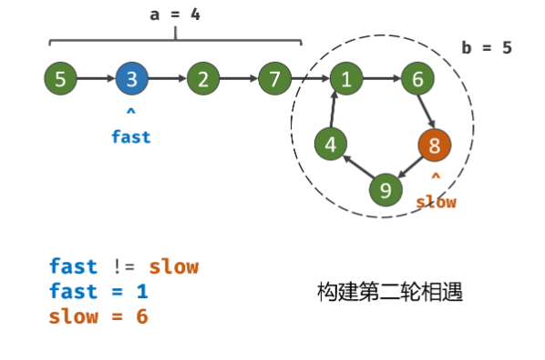

# 2024/4/20 代码随想录 Day4 24. 两两交换链表中的节点, 19.删除链表的倒数第N个节点,160 链表相交, 142.环形链表II 
 
## 24. 两两交换链表中的节点

[题目链接 24](https://leetcode.cn/problems/swap-nodes-in-pairs/description/) 
给你一个链表，两两交换其中相邻的节点，并返回交换后链表的头节点。你必须在不修改节点内部的值的情况下完成本题（即，只能进行节点交换）。

### 第一次提交
```cpp
class Solution {
public:
    ListNode* swapPairs(ListNode* head) {
        if (head == nullptr || head->next == nullptr) {
            return head;
        }
        ListNode* dummyHead = new ListNode(0, head);
        ListNode* nodePrev = dummyHead, *node1 = head, *node2 = head->next, *nodeNxt = node2->next;
        while(node2 != nullptr && node1!= nullptr) {
            nodePrev->next = node2;
            node2->next = node1;
            node1->next = nodeNxt;
            // move
            if (nodeNxt != nullptr) {
                nodePrev = node1;
                node1 = nodeNxt;
                node2 = nodeNxt->next;
                if (node2!= nullptr)  {
                    nodeNxt = node2->next;
                }
            } else {
                node1 = nullptr;
            }
            
        }
        return dummyHead->next;
    }
};
```
### 复现学习优秀题解
[随想录](https://programmercarl.com/0024.%E4%B8%A4%E4%B8%A4%E4%BA%A4%E6%8D%A2%E9%93%BE%E8%A1%A8%E4%B8%AD%E7%9A%84%E8%8A%82%E7%82%B9.html)
[视频链接](https://www.bilibili.com/video/BV1YT411g7br/?vd_source=4cca6f0dd2495280b5f065c0e86f221c) 不需四个指针，但是多个指针会显得比较i清晰


#### c++ Version
```cpp
class Solution {
public:
    ListNode* swapPairs(ListNode* head) {
        if (head == nullptr || head->next == nullptr) {
            return head;
        }
        ListNode* dummyHead = new ListNode(0, head);
        ListNode* cur = dummyHead;
        while(cur->next != nullptr && cur->next->next != nullptr) {
            ListNode* tmp = cur->next; // 记录临时节点
            ListNode* tmp1 = cur->next->next->next; // 记录临时节点
            cur->next = cur->next->next;    // 步骤一
            cur->next->next = tmp;          // 步骤二
            cur->next->next->next = tmp1;   // 步骤三
            cur = cur->next->next;
        }
        ListNode* result = dummyHead->next;
        delete dummyHead;
        return result;
    }
};
```
第一次解法比较清晰，这里写一下其python形式
#### python Version
```python
class Solution:
    def swapPairs(self, head: Optional[ListNode]) -> Optional[ListNode]:
        dummyHead = ListNode(0, head)
        if not head:
            return head
        if not head.next:
            return head
        prev = dummyHead
        node1 = head
        node2 = head.next
        nxt = head.next.next
        while node1 and node2:
            prev.next = node2
            node1.next = nxt
            node2.next = node1
            prev = node1
            node1 = nxt
            if node1 and node1.next:
                node2 = node1.next
                nxt = node2.next
            else :
                node1 = None
        return dummyHead.next
```
## 19.删除链表的倒数第N个节点
[题目链接 19](https://leetcode.cn/problems/remove-nth-node-from-end-of-list/description/) 
给你一个链表，删除链表的倒数第 n 个结点，并且返回链表的头结点。
### 第一次提交
比较取巧的用了unordered_map。
```cpp
class Solution {
public:
    ListNode* removeNthFromEnd(ListNode* head, int n) {
        unordered_map<int, ListNode*> match;
        ListNode* cur =new ListNode(0, head);
        ListNode* dummyHead = cur;
        int now = -1;
        while (cur != nullptr) {
            match[now++] = cur;
            cur = cur->next;
        }
        match[now] = nullptr;
        if (n > now) return nullptr;
        else {
            match[now - n - 1]->next = match[now - n + 1];
            return dummyHead->next;
        }
    }
};
```
### 复现学习优秀题解
[随想录](https://programmercarl.com/0019.%E5%88%A0%E9%99%A4%E9%93%BE%E8%A1%A8%E7%9A%84%E5%80%92%E6%95%B0%E7%AC%ACN%E4%B8%AA%E8%8A%82%E7%82%B9.html)
[视频链接](https://www.bilibili.com/video/BV1vW4y1U7Gf/) Fast&Slow 指针
#### c++ Version

```cpp
class Solution {
public:
    ListNode* removeNthFromEnd(ListNode* head, int n) {
        ListNode* dummyHead = new ListNode(0, head);
        ListNode* slow = dummyHead,* fast = dummyHead;
        while(n-- && fast != nullptr) {
            fast = fast->next;
        }
        while(fast->next != nullptr) {
            slow = slow->next;
            fast = fast->next;
        }
        if (slow != nullptr && slow->next != nullptr)
            slow -> next = slow ->next ->next;
        return dummyHead->next;
    }
};

```
#### Python Version
```python
class Solution:
    def removeNthFromEnd(self, head: Optional[ListNode], n: int) -> Optional[ListNode]:
        fast = slow = dummy = ListNode(0, head)
        for i in range(n):
            fast = fast.next
        while fast.next:
            slow = slow.next
            fast = fast.next
        slow.next = slow.next.next
        return dummy.next
```
## 160 链表相交
[题目链接 160](https://leetcode.cn/problems/intersection-of-two-linked-lists-lcci/description/) 
给你两个单链表的头节点 headA 和 headB ，请你找出并返回两个单链表相交的起始节点。如果两个链表没有交点，返回 null 。
### 学习优秀题解
[双指针](https://leetcode.cn/problems/intersection-of-two-linked-lists-lcci/)

十分巧妙

A： c+m

B： d+m

pA，pB 同时走了c+d+m
```cpp
class Solution {
public:
    ListNode* getIntersectionNode(ListNode* headA, ListNode* headB) {
        ListNode *A = headA, *B = headB;
        if (headA == nullptr || headB == nullptr) {
            return nullptr;
        }
        while (A != B) {
            A = A == nullptr ? headB : A->next;
            B = B == nullptr ? headA : B->next;
        }
        return A;
    }
};
```
非常优雅的做法
```python
class Solution:
    def getIntersectionNode(self, headA: ListNode, headB: ListNode) -> ListNode:
        A, B = headA, headB
        while A != B:
            A = A.next if A else headB
            B = B.next if B else headA
        return A
```

## 142.环形链表II
[题目链接 160](https://leetcode.cn/problems/linked-list-cycle-ii/)给定一个链表的头节点  head ，返回链表开始入环的第一个节点。 如果链表无环，则返回 null。

如果链表中有某个节点，可以通过连续跟踪 next 指针再次到达，则链表中存在环。 为了表示给定链表中的环，评测系统内部使用整数 pos 来表示链表尾连接到链表中的位置（索引从 0 开始）。如果 pos 是 -1，则在该链表中没有环。注意：pos 不作为参数进行传递，仅仅是为了标识链表的实际情况。
不允许修改 链表。

### 第一次提交
直接想法是用哈希表直接干掉
```cpp
class Solution {
public:
    ListNode *detectCycle(ListNode *head) {
        unordered_set<ListNode*> set;
        ListNode* cur = head;
        while(cur != nullptr) {
            if (set.count(cur)) return cur;
            else set.insert(cur);
            cur = cur->next;
        }
        return nullptr;
    }
};
```
但明显这样不够优雅
### 复现学习优秀题解
[随想录](https://programmercarl.com/0142.%E7%8E%AF%E5%BD%A2%E9%93%BE%E8%A1%A8II.html)
[视频链接](https://www.bilibili.com/video/BV1if4y1d7ob/) Fast&Slow 指针的进阶


#### c++Version
```cpp
class Solution {
public:
    ListNode* detectCycle(ListNode* head) {
        ListNode *fast = head, *slow = head;
        while (fast != nullptr && fast->next != nullptr) {
            slow = slow->next;
            fast = fast->next->next;
            if (slow == fast) {
                fast = head;
                while (fast != slow) {
                    fast = fast->next;
                    slow = slow->next;
                }
                return fast;
            }
        }
        return nullptr;
    }
};
```
#### Python Version
```python
class Solution:
    def detectCycle(self, head: Optional[ListNode]) -> Optional[ListNode]:
        fast, slow = head, head
        while fast and fast.next:
            fast , slow = fast.next.next, slow.next
            if fast == slow:
                fast = head
                while fast != slow:
                    fast, slow = fast.next, slow.next
                return fast
        return None
```