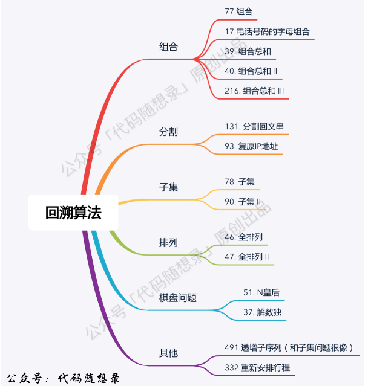

# 代码随想录Day27 | 回溯 ● 77. 组合  

##  理论基础


[随想录](https://programmercarl.com/%E5%9B%9E%E6%BA%AF%E7%AE%97%E6%B3%95%E7%90%86%E8%AE%BA%E5%9F%BA%E7%A1%80.html#%E9%A2%98%E7%9B%AE%E5%88%86%E7%B1%BB)
```cpp
void backtracking(参数) {
    if (终止条件) {
        存放结果;
        return;
    }

    for (选择：本层集合中元素（树中节点孩子的数量就是集合的大小）) {
        处理节点;
        backtracking(路径，选择列表); // 递归
        回溯，撤销处理结果
    }
}
```
## 77. 组合
[题目链接](https://leetcode.cn/problems/combinations/)
给定两个整数 n 和 k，返回范围 [1, n] 中所有可能的 k 个数的组合。

你可以按 任何顺序 返回答案。

### 经典回溯方法

```cpp
class Solution {
public:
    vector<vector<int>> res;
    vector<int> path;
    void backtrack(int n , int k, int cur) {
        if (path.size() == k) {
            res.push_back(path);
            return;
        } 
        for (; cur <= n; cur ++) {
            path.push_back(cur);
            backtrack(n, k, cur +1);
            path.pop_back();
        }        
    }
    vector<vector<int>> combine(int n, int k) {
        backtrack(n, k, 1);
        return res;
    }
};
```

### 剪枝
```cpp
class Solution {
public:
    vector<vector<int>> res;
    vector<int> path;
    void backtrack(int n , int k, int cur) {
        if (path.size() == k) {
            res.push_back(path);
            return;
        } else {
            for (; cur <= n - (k - path.size())+ 1 ; cur ++) {
                path.push_back(cur);
                backtrack(n, k, cur +1);
                path.pop_back();
            }
        }
    }
    vector<vector<int>> combine(int n, int k) {
        backtrack(n, k, 1);
        return res;
    }
};
```

### 回溯法的打印日志

如何debug

```cpp
class Solution {
public:
    vector<vector<int>> res;
    vector<int> path;
    void backtrack(int n , int k, int cur) {
        if (path.size() == k) {
            res.push_back(path);
            return;
        } else {
            for (; cur <= n - (k - path.size())+ 1 ; cur ++) {
                path.push_back(cur);
                cout<< "回溯之前=>";
                for (auto i : path) cout<< i << " ";
                cout<< endl;
                backtrack(n, k, cur +1);
                path.pop_back();
                cout<< "回溯之后=>";
                for (auto i : path) cout<< i << " ";
                cout<< endl;
            }
        }
    }
    vector<vector<int>> combine(int n, int k) {
        backtrack(n, k, 1);
        return res;
    }
};
```

```
回溯之前=>1 
回溯之前=>1 2 
回溯之前=>1 2 3 
回溯之后=>1 2 
回溯之前=>1 2 4 
回溯之后=>1 2 
回溯之后=>1 
回溯之前=>1 3 
回溯之前=>1 3 4 
回溯之后=>1 3 
回溯之后=>1 
回溯之后=>
回溯之前=>2 
回溯之前=>2 3 
回溯之前=>2 3 4 
回溯之后=>2 3 
回溯之后=>2 
回溯之后=>
```

### 相关视频

[回溯理论](https://www.bilibili.com/video/BV1cy4y167mM/?spm_id_from=333.788&vd_source=4cca6f0dd2495280b5f065c0e86f221c)

[组合](https://programmercarl.com/0077.%E7%BB%84%E5%90%88.html#%E7%AE%97%E6%B3%95%E5%85%AC%E5%BC%80%E8%AF%BE) 

[视频](https://www.bilibili.com/video/BV1ti4y1L7cv/?spm_id_from=333.788&vd_source=4cca6f0dd2495280b5f065c0e86f221c)

[组合剪枝](https://programmercarl.com/0077.%E7%BB%84%E5%90%88%E4%BC%98%E5%8C%96.html)

[视频](https://www.bilibili.com/video/BV1wi4y157er/?spm_id_from=333.788&vd_source=4cca6f0dd2495280b5f065c0e86f221c)
