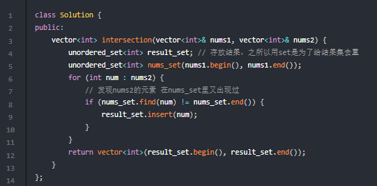

# 2024/4/22 代码随想录Day 6：哈希表理论基础 242.有效的字母异位词  349. 两个数组的交集 

## 哈希表理论基础

[随想录文章链接](https://programmercarl.com/%E5%93%88%E5%B8%8C%E8%A1%A8%E7%90%86%E8%AE%BA%E5%9F%BA%E7%A1%80.html) 

##  242.有效的字母异位词 

 数组 用来做哈希表 给我们带来的便利之处


[题目链接 242](https://leetcode.cn/problems/valid-anagram/description/) 给定两个字符串 s 和 t ，编写一个函数来判断 t 是否是 s 的字母异位词。
注意：若 s 和 t 中每个字符出现的次数都相同，则称 s 和 t 互为字母异位词。

 
### 第一次提交
[随想录](https://programmercarl.com/0242.%E6%9C%89%E6%95%88%E7%9A%84%E5%AD%97%E6%AF%8D%E5%BC%82%E4%BD%8D%E8%AF%8D.html)
[视频链接](https://www.bilibili.com/video/BV1YG411p7BA/)
使用数组作为哈希表的容器
#### c++ version 
``` cpp
class Solution {
public:
    bool isAnagram(string s, string t) {
        int count[26] = {0};
        for (int i = 0; i < s.size(); i++) {
            count[s[i] - 'a'] ++;
        }
        for (int i = 0; i < t.size(); i++) {
            count[t[i] - 'a'] --;
        }
        for (int i = 0; i <26; i++) {
            if (count[i] != 0) return false;
        }
        return true;
    }
};
```
#### Python Version
```python
class Solution:
    def isAnagram(self, s: str, t: str) -> bool:
        record = [0] * 26
        for i in s:
            #并不需要记住字符a的ASCII，只要求出一个相对数值就可以了
            record[ord(i) - ord("a")] += 1
        for i in t:
            record[ord(i) - ord("a")] -= 1
        for i in range(26):
            if record[i] != 0:
                #record数组如果有的元素不为零0，说明字符串s和t 一定是谁多了字符或者谁少了字符。
                return False
        return True
```
## 349. 两个数组的交集

[题目链接 242](https://leetcode.cn/problems/intersection-of-two-arrays/) 给定两个数组 nums1 和 nums2 ，返回 它们的 
交集
 。输出结果中的每个元素一定是 唯一 的。我们可以 不考虑输出结果的顺序 。

### 第一次提交
```cpp
class Solution {
public:
    vector<int> intersection(vector<int>& nums1, vector<int>& nums2) {
        unordered_set<int> set, res;
        vector<int> result;
        for (auto i : nums1) set.insert(i);
        for (auto i : nums2) {
            if (set.count(i)) res.insert(i);
        }
        for (int i : res) result.push_back(i);
        return result;
    }
};
```


### 学习优秀题解
直接使用set 不仅占用空间比数组大，而且速度要比数组慢，set把数值映射到key上都要做hash计算的。

不要小瞧 这个耗时，在数据量大的情况，差距是很明显的。
[随想录](https://programmercarl.com/0349.%E4%B8%A4%E4%B8%AA%E6%95%B0%E7%BB%84%E7%9A%84%E4%BA%A4%E9%9B%86.html#%E6%80%9D%E8%B7%AF)
[视频链接](https://www.bilibili.com/video/BV1ba411S7wu/)
哈希表跟 vector 的互相转化

```cpp
class Solution {
public:
    vector<int> intersection(vector<int>& nums1, vector<int>& nums2) {
        unordered_set<int> set(nums1.begin(),nums1.end()), res;
        for (int i : nums2) {
            if (set.count(i)) res.insert(i);
        }
        vector<int> result(res.begin(),res.end());
        return result;
    }
};
```
python 中字典的应用
table.get(num, 0)：
The expression table.get(num, 0) retrieves the value associated with the key num from the hash table table. If the key is not found in the hash table, it returns the default value 0.

使用集合存放结果
```python
class Solution:
    def intersection(self, nums1: List[int], nums2: List[int]) -> List[int]:
        table = {}
        for num in nums1:
            table[num] = table.get(num, 0) + 1
        res = set()
        for num in nums2:
            if num in table:#table.get(num, 0):
                res.add(num)
        return list(res)
```
优雅的一行写法
```python
class Solution:
    def intersection(self, nums1: List[int], nums2: List[int]) -> List[int]:
        return list(set(nums1) & set(nums2))
```