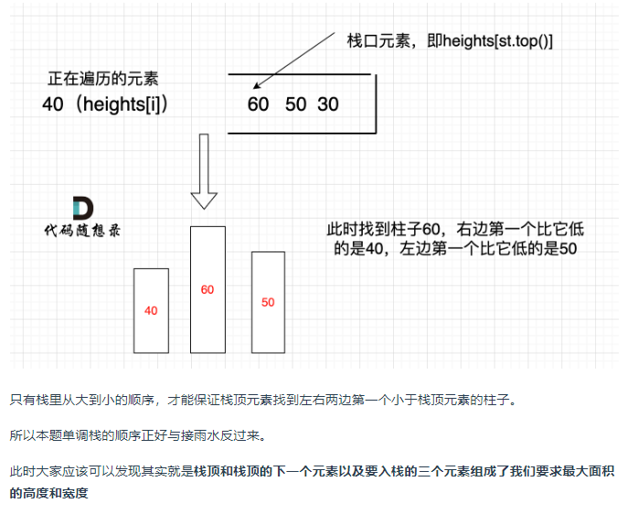

# 随想录Day63 |  单调栈 42. 接雨水  84.柱状图中最大的矩形


##  42. 接雨水
[题目链接 42](https://leetcode.cn/problems/trapping-rain-water/description/)

给定 n 个非负整数表示每个宽度为 1 的柱子的高度图，计算按此排列的柱子，下雨之后能接多少雨水。

 
### 第一次提交
```cpp
class Solution {
public:
    int trap(vector<int>& height) {
        stack<int> mono;
        mono.push(-1);
        int res = 0;
        for (int i = 0; i < height.size(); i++) {
            if (mono.top() == -1) {
                mono.push(i);
            } else if (height[mono.top()] > height[i]) {
                mono.push(i);
            } else if (height[mono.top()] <= height[i])  {
                int low = height[mono.top()];
                while(mono.top() != -1 && height[mono.top()] <= height[i]) {
                    int high = height[mono.top()];
                    int width = i - mono.top()-1;
                    res += (high - low) * width;
                    low = high;
                    mono.pop();
                } 
                if (mono.top()!=-1){
                int high = height[i];
                int width = i - mono.top()-1;
            res += (high - low) * width;}
                mono.push(i);
            }
            cout << i << " i " << res <<" res "<<endl;
        }
        return res;
    }
};
```
### 学习题解
简化讨论情况
```cpp
class Solution {
public:
    int trap(vector<int>& height) {
        stack<int> mono;
        mono.push(-1);
        int res = 0;
        for (int i = 0; i < height.size(); i++) {
            while(mono.top() != -1 && height[i] > height[mono.top()]) {
                int mid = mono.top();
                mono.pop();
                if (mono.top() != -1) {
                    int floor = min(height[i], height[mono.top()]);
                    int tall = floor -  height[mid];
                    int width = i - mono.top() -1;
                    res += tall * width;
                }
            }
            mono.push(i);
        }
        return res;
    }
};
```

## 84.柱状图中最大的矩形

[题目链接 84](https://leetcode.cn/problems/largest-rectangle-in-histogram/)

nums1 中数字 x 的 下一个更大元素 是指 x 在 nums2 中对应位置 右侧 的 第一个 比 x 大的元素。

给你两个 没有重复元素 的数组 nums1 和 nums2 ，下标从 0 开始计数，其中nums1 是 nums2 的子集。

对于每个 0 <= i < nums1.length ，找出满足 nums1[i] == nums2[j] 的下标 j ，并且在 nums2 确定 nums2[j] 的 下一个更大元素 。如果不存在下一个更大元素，那么本次查询的答案是 -1 。

返回一个长度为 nums1.length 的数组 ans 作为答案，满足 ans[i] 是如上所述的 下一个更大元素 。

### 第一次提交
```cpp
class Solution {
public:
    int largestRectangleArea(vector<int>& heights) {
        stack<int> mono;
        mono.push(-1);
        int res = 0;
        heights.push_back(-1);
        for (int i = 0; i < heights.size(); i++) {
            if (mono.top() == -1 || heights[i] >= heights[mono.top()]) mono.push(i);
            else {
                //cout << i << " " <<mono.top()<<endl;
                while(mono.top() != -1 && heights[i] < heights[mono.top()]) {
                    int mid = heights[mono.top()];
                    mono.pop();
                    int width = i - mono.top() - 1;
                    res = max(res, width* mid);
                    //cout <<i << " "<< width << " " <<mid << endl;
                }
                mono.push(i);
            }
        }
        return res;
    }
};
```
### 学习题解


可以在数组头尾加入最小元素来起到在stack加入-1元素同样效果。